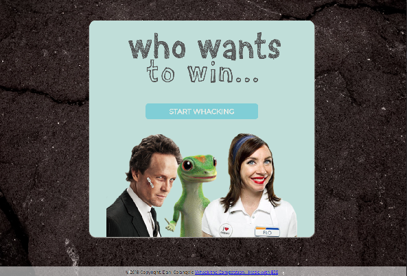
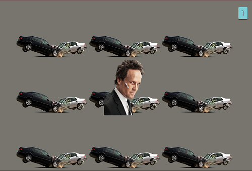

# Whack the Competition

---

## In Brief

#### A fun take on the classic Whack-a-Mole which allows the user to whack the competition in the insurance industry.

#### Stretch goals include:

- optimizing images to better fit viewport
- enabling mascot images to appear behind "dirt" images
- allowing the user to replay the current level
- improving the scoring logic
- improving overall game logic

## The Game

#### The game runs on a set interval for each level. When the time is up, the user will either advance to the next level or be allowed to reset the game depending on their score.

#### The player gets one point for each time they whack a mascot. As the player's score increases, the mascots will also appear with increasing frequency.

##### _Level 1 allows the player to try whacking Mayhem from the Allstate commercials._

#### _Level 2 allows the player to try whacking the Geico Gecko._

#### _Level 3 allows the player to try whacking Flo from Progressive._

## Build Status

##### This project is fully functional, but has the potential to become an expansive and more interactive game.

#### All validations (CSS, HTML, JavaScript) have been passed with no errors.

## Tech Details

##### Built with:

- Node JS
  - Express
  - EJS
- HTML
- CSS
- jQuery

#### I am proud to say that this game was only built with one external library, jQuery. All styling was done directly through CSS with media queries added to enable responsiveness.
